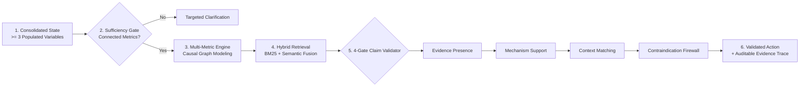

# Darukaa BioIntel
### AI Biodiversity Intelligence & Evidence-Constrained Decision Support

Darukaa BioIntel is a scientific decision-support platform designed for ecological restoration, biodiversity enhancement, and sustainable land stewardship. Rather than acting as an unconstrained generative chatbot, it combines:

- **Structured Environmental State** with explicit provenance and authority tiers
- **Hybrid Scientific Retrieval** fusing BM25 lexical search and dense semantic similarity
- **Multi-Metric Ecological Reasoning** concurrently modeling ≥ 3 environmental variables
- **Evidence-Constrained Recommendations** bounded strictly by peer-reviewed literature
- **Claim-Level Validation** auditing quantitative effect sizes and causal alignment
- **Contraindication Safeguards** blocking high-risk interventions in vulnerable parcels
- **Auditable Evidence Traces** linking every recommendation to primary source excerpts with DOIs

---

## The Problem

Generic large language models struggle with high-stakes ecological and agricultural decision support:
1. **Hallucinated Interventions**: LLMs recommend generic practices without verifying whether local soil or climatic conditions support them.
2. **Missing Citations & Unbacked Numbers**: LLMs cite non-existent papers or invent precise percentages (e.g., *"increases SOC by 45%"*) without empirical basis.
3. **Single-Variable Blindness**: Recommending interventions based solely on crop type while ignoring soil organic carbon or rainfall deficits can cause catastrophic failures (e.g., cover crops consuming critical soil moisture during extreme drought).
4. **Silent Overwrites**: Chatbots lose context or overwrite confirmed user facts when contradictory statements are introduced.

---

## The Solution: Evidence-Constrained Generation (ECG)

Darukaa BioIntel implements an **Evidence-Constrained Generation (ECG)** architecture that enforces strict scientific firewalls between state observation, literature retrieval, causal reasoning, and recommendation output.



---

## Key Architectural Differentiators

### 1. Multi-Metric Ecological Reasoning (≥ 3 Variables)
The system never operates on isolated variables. In the canonical challenge scenario, it concurrently evaluates:
- **Region**: Semi-arid drylands
- **Soil Condition**: 0.3% Soil Organic Carbon (severely depleted)
- **Climate Regime**: Low rainfall (< 400 mm/year)
- **Current Crop**: Wheat
- **Land Cover**: Continuous monoculture

It constructs an active causal graph linking monoculture to carbon loss, and carbon depletion to reduced soil water holding capacity under water-limited regimes.

### 2. Exogenous Climate Boundary vs. Soil Moisture Retention
The reasoning engine maintains strict ecological thermodynamics:
- **`climate.rainfall` is an Exogenous Forcing**: Macroclimatic precipitation is a boundary condition, not a variable created by agricultural practices.
- **Interventions Modulate `soil.moisture` and Infiltration**: Recommended practices (e.g., surface residue retention) improve **soil moisture retention capacity (`soil.moisture`)** and water infiltration efficiency, rather than altering atmospheric rainfall.

### 3. Authority Separation & Conflict Tracking
The state manager distinguishes provenance origin from authority level:

```text
AuthorityLevel.USER_DIRECT > AuthorityLevel.EXTERNAL > AuthorityLevel.INFERRED
```

- An inferred model estimate can **never** overwrite an explicit user observation.
- When two contradictory user observations are introduced (e.g., user initially states *"wheat monoculture"* and later *"primary crop is barley"*), the system refuses to silently overwrite. It generates an explicit `ConflictRecord` (`unresolved`) and asks for confirmation.

### 4. Deterministic 4-Gate Claim Validator
Before any recommendation reaches the user, it must pass 4 consecutive deterministic gates:
1. **Gate 1: Evidence Presence Gate**: Ensures candidate interventions reference actual indexed chunks in the knowledge base.
2. **Gate 2: Mechanism Support Gate**: Verifies that the intervention mechanism and affected metrics are substantiated in the cited text.
3. **Gate 3: Context Compatibility Gate**: Uses `ContextMatcher` to verify that regional, soil, and management requirements match active state.
4. **Gate 4: Quantitative Verbatim Audit & Contraindication Firewall**:
   - Audits numerical figures and percentages; rejects ungrounded quantitative claims.
   - The current evaluation configuration hard-blocks the cover-crop candidate below 300 mm/year annual rainfall because of the modeled moisture-competition contraindication.

### 5. Deterministic Out-of-Domain (OOD) Abstention
In hybrid retrieval over specialized scientific corpora, non-zero similarity scores on out-of-scope topics are inevitable. Darukaa BioIntel defines an explicit decision boundary (`EVIDENCE_ACCEPTANCE_THRESHOLD = 0.50`). Retrieval scores below $0.50$ are treated as background noise rather than accepted evidence ($0/5$ OOD queries accepted).

---

## Quickstart

### 1. Prerequisites
- Python 3.11+
- Node.js 18+

### 2. Backend Setup
```bash
# 1. Create and activate virtual environment
python -m venv .venv
source .venv/bin/activate   # or .\.venv\Scripts\Activate.ps1 on Windows

# 2. Install dependencies
pip install -r backend/requirements.txt

# 3. Initialize knowledge store & build search index
python -c "import sys; sys.path.insert(0, 'backend'); from app.knowledge.indexer import IngestionPipeline; IngestionPipeline().run()"

# 4. Start FastAPI server
uvicorn app.main:app --reload --port 8000 --app-dir backend
```
- API Docs: `http://localhost:8000/docs`
- Health Endpoint: `http://localhost:8000/api/health`

### 3. Frontend Setup
```bash
cd frontend
npm install
npm run dev
```
- Web Application: `http://localhost:5173`

---

## Evaluator Walkthrough & Demos

For a comprehensive evaluator walkthrough with pre-configured scenarios, refer to [`docs/DEMO_SCRIPT.md`](docs/DEMO_SCRIPT.md):
- **Scenario 1: Canonical Challenge (P0)**: Semi-arid wheat monoculture (0.3% SOC, low rainfall) → multi-metric reasoning (≥ 3 variables), 2 validated interventions, complete evidence chain.
- **Scenario 2: Conversational Clarification**: Vague query ("Biodiversity is declining") → targeted diagnostic questions without guessing.
- **Scenario 3: Severe Drought Contraindication**: Rainfall < 300 mm/year → cover crops blocked due to moisture competition risk; residue retention preserved.
- **Scenario 4: Contradiction Tracking**: Conflicting observations → explicit `ConflictRecord` created without data loss.
- **Scenario 5: Adversarial Security Boundary**: Prompt injection attempting override → hard blocked by evidence firewall.
- **Scenario 6: Developer & Evidence Trace**: Audit raw extracted observations, retrieval queries, and claim checklists in real-time.

---

## Evaluation & Benchmarking

Darukaa BioIntel includes a standalone, reproducible evaluation framework ([`backend/scripts/run_evaluation.py`](backend/scripts/run_evaluation.py)) measuring system performance against the 5 official hackathon criteria across 15 benchmark test cases (T-001 to T-015) and an extended 20-query retrieval benchmark.

### Hackathon Criteria Score Breakdown
*(Computed using official challenge category weights)*

| Category | Weight | Benchmark Focus | Passed | Pass Rate | Weighted Score |
| :--- | :---: | :--- | :---: | :---: | :---: |
| **Depth of Reasoning** | 30% | Multi-metric reasoning, context matching, sufficiency | 3/3 | 100.0% | **30.00 / 30.0** |
| **Scientific Grounding** | 25% | Quantitative firewall, evidence lineage, anti-hallucination | 3/3 | 100.0% | **25.00 / 25.0** |
| **Knowledge / Retrieval** | 20% | Extended 20-query benchmark (R@5, MRR, OOD abstention) | 1/1 | 100.0% | **19.33 / 20.0** |
| **Conversational Intelligence** | 15% | Clarification flow, state persistence, conflict tracking | 5/5 | 100.0% | **15.00 / 15.0** |
| **Output Clarity & Safety** | 10% | Out-of-scope handling, contraindications, prompt security | 3/3 | 100.0% | **10.00 / 10.0** |
| **TOTAL** | **100%** | **Comprehensive System Evaluation** | **15/15** | **100.0%** | **99.33 / 100.00** |

> [!NOTE]
> **Retrieval Score Formulation (19.33 / 20.00)**: The Knowledge/Retrieval category score is derived strictly from the 20-query extended benchmark:
> ```text
> T-014 Score = (Recall@5 × 0.40) + (MRR × 0.40) + (OOD_Abstention × 0.20)
>             = (1.00 × 0.40) + (0.9167 × 0.40) + (1.00 × 0.20)
>             = 0.9667 (96.67%)
> ```
> Multiplying by the 20% category weight yields exactly **19.33 / 20.00**.

### Extended 20-Query Retrieval Benchmark (T-014)
| Metric | Result | Benchmark Target | Status |
| :--- | :---: | :---: | :---: |
| **Recall@1** | 86.67% | ≥ 60.0% | ✅ Pass |
| **Recall@3** | 93.33% | ≥ 75.0% | ✅ Pass |
| **Recall@5** | 100.00% | ≥ 80.0% | ✅ Pass |
| **Mean Reciprocal Rank (MRR)** | 0.9167 | ≥ 0.7000 | ✅ Pass |
| **Precision@5** | 29.33% | ≥ 25.0% | ✅ Pass |
| **OOD Accepted Matches** | 0 / 5 | == 0 | ✅ Pass (Zero OOD Accepted) |

To reproduce the evaluation report locally:
```bash
python backend/scripts/run_evaluation.py
```
Generated reports are saved to [`docs/EVALUATION_REPORT.md`](docs/EVALUATION_REPORT.md) and [`docs/evaluation_report.json`](docs/evaluation_report.json).

---

## Scientific Claims Audit

To ensure the highest scientific integrity, Darukaa BioIntel enforces the following verifiable audit checklist:
- [x] **Every quantitative claim has direct evidence**: Percentages and ranges are audited verbatim against cited chunks.
- [x] **Every DOI and URL corresponds to an actual indexed source**: 10 peer-reviewed landmark sources in `data/corpus_manifest.json`.
- [x] **No fabricated study, year, or publisher**: Primary metadata is immutably stored in SQLite and indexed offline.
- [x] **No unsupported causal relationship**: Causal templates require directional keyword matches in retrieved evidence.
- [x] **Rainfall is treated as an exogenous climate variable**: Macroclimate precipitation drives context; interventions modulate soil water retention.
- [x] **No recommendation bypasses evidence validation**: The 4-gate validator intercepts unbacked or contra-indicated proposals.
- [x] **No frontend-generated scientific claims**: The React UI is strictly a presentation layer; the backend is the sole scientific authority.
- [x] **Evaluation scores reflect internal benchmark measurements**: Clearly documented as internal hackathon-criteria-aligned evaluation results.

---

## Technology Stack

- **Backend**: Python 3.11, FastAPI, Pydantic v2, SQLite (`data/knowledge.db`, `data/state.db`)
- **Information Retrieval**: Inverted Index BM25 lexical search + dense semantic reranking with Reciprocal Rank Fusion (RRF)
- **Frontend**: React 18, TypeScript, Vite, Tailwind CSS, Lucide Icons
- **Testing & Benchmarking**: Pytest, TestClient, custom deterministic evaluation harness

---

## Repository Structure

```text
Darukaa-BioIntel/
├── README.md                          # Main judge-ready project documentation
├── AGENTS.md                          # Agent engineering and architectural constraints
├── DECISIONS.md                       # Architectural Decision Records (ADRs)
├── backend/
│   ├── app/
│   │   ├── api/                       # Thin FastAPI HTTP routes
│   │   ├── conversation/              # Turn management, query parsing, completeness checking
│   │   ├── evaluation/                # 15 benchmark cases, 20-query suite, EvaluationRunner
│   │   ├── knowledge/                 # SQLite storage, corpus chunker, BM25 indexing
│   │   ├── reasoning/                 # Multi-metric engine, causal templates, sufficiency gate
│   │   ├── recommendation/            # 4-gate evidence validator, ECG generator
│   │   ├── retrieval/                 # Hybrid BM25 + Semantic fusion retriever
│   │   ├── schemas/                   # Pydantic v2 domain contracts
│   │   ├── services/                  # Application-scoped EnvironmentalChatService
│   │   └── state/                     # SQLite observation history, authority precedence, conflicts
│   ├── scripts/
│   │   └── run_evaluation.py          # Standalone benchmark execution script
│   └── tests/                         # Comprehensive regression and audit test suites
├── data/
│   ├── corpus/                        # 10 peer-reviewed sources across 4 domains
│   ├── corpus_manifest.json           # Manifest with source DOIs, publishers, and topics
│   └── lexical_index.json             # Serialized BM25 inverted index
├── docs/
│   ├── 02-architecture.md             # Detailed system architecture and dataflow
│   ├── 04-reasoning-engine.md         # Multi-metric causal reasoning and climate boundaries
│   ├── 09-evaluation.md               # Evaluation specification and scoring methodology
│   ├── DEMO_SCRIPT.md                 # Step-by-step evaluator testing guide
│   ├── SETUP_GUIDE.md                 # Local installation and reproduction guide
│   ├── EVALUATION_REPORT.md           # Generated markdown evaluation report
│   └── evaluation_report.json         # Structured JSON evaluation results
└── frontend/                          # React + TypeScript decision-support UI
```

---

## Known Limitations & Boundary Scope

1. **Curated Corpus Scale**: The knowledge base is intentionally scoped to 10 landmark, peer-reviewed sources (FAO, IPCC, Science, Nature) covering key agricultural and dryland restoration domains. While highly dense and reproducible, it is not an exhaustive global database.
2. **Spatial GIS Boundaries**: The platform evaluates localized categorical and quantitative observations (e.g., rainfall in mm, SOC in %); it does not currently ingest spatial GeoTIFF rasters or perform GIS polygon clipping.
3. **Synthetic Out-of-Domain Queries**: The 5 OOD benchmark queries are representative stress tests (automotive, software, medical); real-world queries may present ambiguous borderline agricultural queries requiring domain-expert adjudication.
