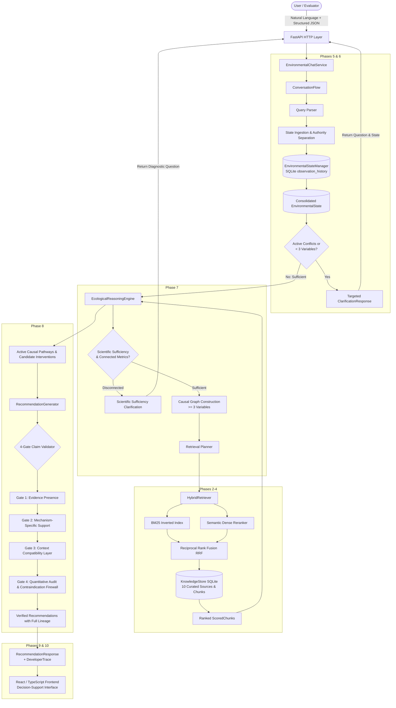

# 02 — Final System Architecture

## End-to-End System Architecture

Darukaa BioIntel is architected as an **Evidence-Constrained Scientific Decision-Support System** rather than an unconstrained generative chatbot. Every recommendation is bounded by retrieved scientific literature, evaluated across a structured multi-metric environmental state, and passed through deterministic claim-level validation firewalls before reaching the user.



---

## Architectural Subsystems

### 1. State & Provenance Subsystem (`backend/app/state/`)
- **Authority Separation (`AuthorityLevel`)**:
  - `USER_DIRECT`: Assigned to user statements and structured inputs.
  - `EXTERNAL`: Assigned to retrieved database records.
  - `INFERRED`: Assigned to model estimations.
  - **Precedence Rule**:
    ```text
    AuthorityLevel.USER_DIRECT > AuthorityLevel.EXTERNAL > AuthorityLevel.INFERRED
    ```
    Inferred values can never overwrite direct user observations.
- **Immutable Observation History**: Every observation is assigned a deterministic ID (e.g., `OBS-conv-soil_organic_carbon-001`) and immutably appended to SQLite.
- **Active Conflict Tracking**: Equal-authority contradictions produce an explicit `ConflictRecord` (`unresolved`), preserving the incumbent value and requiring user confirmation rather than silently overwriting.

### 2. Knowledge & Hybrid Retrieval Subsystem (`backend/app/knowledge/`, `backend/app/retrieval/`)
- **Curated Scientific Corpus**: 10 peer-reviewed landmark studies across Soil Health, Land Use, Climate, and Biodiversity.
- **Hybrid Fusion**: Combines BM25 lexical search and dense semantic similarity using Reciprocal Rank Fusion (RRF, $k=60$).
- **Deterministic Out-of-Domain (OOD) Policy**:
  - Strict evidence acceptance threshold: `EVIDENCE_ACCEPTANCE_THRESHOLD = 0.50`.
  - Scores below $0.50$ are classified as background noise, preventing out-of-scope topics from generating accepted evidence.

### 3. Multi-Metric Ecological Reasoning Engine (`backend/app/reasoning/`)
- **Minimum Dimensionality**: Concurrently evaluates $\ge 3$ environmental variables.
- **Scientific Sufficiency Gate**: Blocks reasoning if submitted variables lack essential ecological context (e.g., climate + crop without soil condition or land management).
- **Causal Graph & Directional Verification**: Validates relationship templates against retrieved chunk keywords and directional indicators (`deplet`, `enhanc`, `loss`).
- **Exogenous Climate Boundary Condition**: Explicitly models `climate.rainfall` as an exogenous forcing; soil interventions modulate `soil.moisture` and water infiltration rather than atmospheric rainfall.

### 4. Evidence-Constrained Generation (ECG) & Claim Validator (`backend/app/recommendation/`)
Every candidate intervention must pass 4 consecutive deterministic gates before inclusion in final recommendations:
1. **Gate 1: Evidence Presence Gate**: Intercepts unbacked proposals. Every candidate must cite valid chunk IDs in the knowledge base.
2. **Gate 2: Mechanism-Specific Support Gate**: Cross-references action keywords and affected metrics against the verbatim text of cited chunks.
3. **Gate 3: Context Compatibility Gate**: Verifies regional, climatic, and soil prerequisites against active state using `ContextMatcher`.
4. **Gate 4: Quantitative Verbatim Audit & Contraindication Firewall**:
   - Audits all percentages and numbers; rejects claims not found verbatim in cited evidence.
   - Evaluates contraindications against state (e.g., modeled rule blocking cover crops below 300 mm/year rainfall).

### 5. Application & Evaluation Layer (`backend/app/services/`, `backend/app/evaluation/`)
- **Application-Scoped Lifecycle**: `EnvironmentalChatService` uses shared, reusable components without global singleton pollution.
- **Isolated Evaluation State**: `EvaluationRunner` executes test suites inside disposable SQLite databases (`data/eval_state_{id}.db`) that auto-delete after runs, guaranteeing zero contamination of production data.
